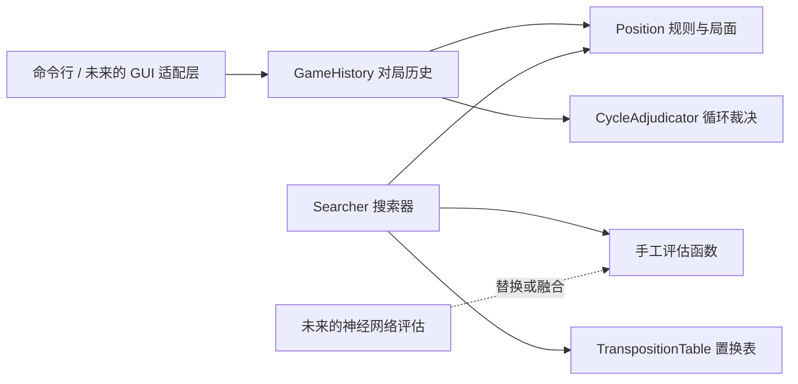

# Chinese Chess AI

一个从零实现的中国象棋 AI 项目。目前仓库包含一套可独立运行的 C++20
象棋内核：它能够解析局面、生成合法走法、执行和撤销走法、维护对局历史，
并使用手工评估函数与 Alpha-Beta 搜索选择着法。

项目的目标不是调用现成象棋引擎，而是逐步完成一套自己的 AI：先建立可靠的
规则与传统搜索基线，再加入神经网络训练和推理，最后通过独立的 GUI 适配层与
棋盘界面交互。

> 当前状态：规则引擎、手工评估、Negamax、Alpha-Beta、静态搜索、迭代加深、
> 置换表和简化循环裁决均已实现；神经网络、训练流水线和 GUI 自动操作尚未实现。

## 项目结构

```text
chinese-cheese-ai/
├── engine/
│   ├── include/xiangqi/
│   │   ├── types.hpp                 # 棋子、颜色、坐标和走法等基础类型
│   │   ├── position.hpp              # 局面、FEN、走法生成、执行与撤销
│   │   ├── game_history.hpp          # 对局记录和历史局面维护
│   │   ├── cycle_adjudicator.hpp     # 三次重复、长将和无吃子裁决
│   │   ├── evaluation.hpp            # 手工局面评估
│   │   ├── search.hpp                # Negamax、Alpha-Beta 和迭代加深
│   │   └── transposition_table.hpp   # 置换表
│   ├── src/                          # 各模块的 C++ 实现和命令行程序
│   └── tests/
│       └── rules_tests.cpp           # 规则、历史、评估和搜索测试
├── .vscode/                          # VS Code 构建、测试和调试配置
├── CMakeLists.txt                    # CMake 构建配置
├── Makefile                          # Make 构建配置
└── compile_flags.txt                 # clangd 编译参数
```

各模块之间的关系如下：



## 实现思路

### 1. 局面表示与合法走法

棋盘使用 90 个格子的紧凑数组保存，并额外记录当前行棋方和 Zobrist 哈希。
每种棋子分别生成伪合法走法，再统一执行一次走法并检查己方将帅是否受到攻击，
从而过滤出真正的合法走法。

规则层已经处理：

- 车的直线移动与阻挡
- 马腿
- 炮架和吃子规则
- 象眼、河界
- 士和将帅的九宫限制
- 兵卒过河前后的移动差异
- 将帅照面
- 将军、将死和困毙
- 禁止任何使己方将帅仍处于被将状态的走法

走法执行采用 `do_move` / `undo_move` 对称设计。撤销信息会保存被吃棋子、
原行棋方和原哈希等状态，因此搜索可以在同一个局面对象上反复试走，而无须在
每个节点复制整张棋盘。

### 2. 局面哈希与对局历史

局面使用增量 Zobrist 哈希，哈希值同时包含棋子位置和当前行棋方。执行或撤销
走法时只更新发生变化的部分，用于快速识别重复局面和查询置换表。

`GameHistory` 在每个半回合记录：

- 走法及其撤销信息
- 行棋方、移动棋子和被吃棋子
- 该步是否造成将军
- 走子前后的局面哈希
- 连续未吃子半回合数

历史裁决器采用当前项目约定的简化规则：

- 同一局面（包括轮到哪一方走）出现三次时进行裁决。
- 如果重复区间内只有一方在自己的每一步都连续将军，则长将方判负。
- 其余三次重复判和。
- 连续 120 个半回合，也就是 60 个整回合没有吃子时判和。

这不是完整的竞赛版长捉语义分析。目前不会识别被追逐棋子、交换价值或
“一将一捉”等复杂责任，非单方长将造成的三次重复一律判和。

### 3. 手工评估函数

评估值以红方减黑方表示，并在搜索入口转换为当前行棋方视角。当前评估由两部分
组成：

- 基础子力价值
- 简单位置价值，包括中心控制、兵卒推进和过河奖励

手工评估的作用是先为搜索建立一个可解释、可测试的基线。未来加入神经网络后，
仍可用它检查训练结果、生成对照数据，或与神经网络评估混合使用。

### 4. Negamax 与 Alpha-Beta 搜索

双方对称的零和搜索被写成 Negamax 形式：当前节点的分数等于对手子节点分数的
相反数。在此基础上使用 Alpha-Beta 窗口剪掉不可能影响最终选择的分支。

仓库同时保留无剪枝 Negamax，便于对照验证 Alpha-Beta 的结果是否正确。搜索器
还会统计主搜索节点、静态搜索节点、剪枝次数和置换表命中次数。

### 5. 静态搜索

固定深度搜索如果正好停在一次交换中间，评估会产生明显波动。静态搜索会在叶子
节点继续搜索吃子着，直到局面相对稳定；如果当前正被将军，则搜索全部合法应将，
避免直接评估一个尚未处理的将军局面。

### 6. 迭代加深与置换表

迭代加深依次搜索深度 1、2、3……，每完成一层就保留该层的最佳着法、评分和
统计信息。这为后续加入限时搜索打下基础，也能为更深一层提供较好的着法顺序。

置换表使用完整 Zobrist 键识别同一局面，缓存以下内容：

- 搜索深度
- 分数
- `EXACT`、`LOWER` 或 `UPPER` 边界类型
- 该局面的最佳着法
- 用于替换策略的搜索代际

搜索命中缓存后可以直接返回结果、收紧 Alpha-Beta 窗口，或优先搜索缓存中的
最佳着法。将杀分数在存取时进行距离归一化，确保同一局面出现在不同搜索层级时
仍然保持“更快将死更好、越晚被将死越好”的顺序。

## 已实现功能

### 规则与局面

- [x] 90 格棋盘、棋子、坐标和走法表示
- [x] 中国象棋 FEN 解析与输出
- [x] 七类棋子的伪合法走法生成
- [x] 将军检测和合法走法过滤
- [x] 走法执行与无损撤销
- [x] 将死和困毙判断
- [x] 增量 Zobrist 哈希

### 历史与裁决

- [x] 完整走法历史和连续撤销
- [x] 吃子、将军和未吃子计数元数据
- [x] 历史局面哈希时间线和重复次数统计
- [x] 三次相同局面判和
- [x] 单方连续长将判负
- [x] 120 个半回合未吃子判和

### 评估与搜索

- [x] 可解释的手工评估函数
- [x] 固定深度 Negamax
- [x] Alpha-Beta 剪枝
- [x] 吃子优先的基础着法排序
- [x] 静态搜索和被将时的应将搜索
- [x] 迭代加深
- [x] 固定容量置换表
- [x] `EXACT` / `LOWER` / `UPPER` 边界缓存
- [x] 哈希着法排序、代际替换和节点统计

### 工程支持

- [x] Make 和 CMake 构建
- [x] 命令行局面展示与搜索演示
- [x] VS Code 构建、测试和调试配置
- [x] Perft、规则、历史裁决、评估和搜索自动测试

## 尚未实现

- [ ] 将 `GameHistory` 的重复与无吃子裁决接入搜索树
- [ ] 完整长捉及更复杂的循环责任判定
- [ ] 时间控制与可中断搜索
- [ ] Killer Move、History Heuristic、PVS、LMR 等搜索增强
- [ ] NNUE 或其他神经网络评估
- [ ] Python 自我对弈、数据生成和训练流水线
- [ ] C++ 神经网络推理与模型加载
- [ ] UCCI 等标准引擎通信协议
- [ ] 棋盘识别、落子和 GUI 控制适配层

其中第一项是近期最重要的搜索正确性工作：裁决器虽然已经能根据真实对局历史
给出结论，但当前 `Searcher` 只接收 `Position`，尚未在搜索分支中同步维护历史，
因此暂时不会主动避开搜索树里的长将或重复和棋。

## 构建与测试

要求支持 C++20 的编译器。核心引擎不依赖第三方库。

使用 Make：

```bash
make
make test
make run
```

使用 CMake：

```bash
cmake -S . -B build
cmake --build build
ctest --test-dir build --output-on-failure
```

## 命令行使用

使用 Make 构建后，可以查看初始局面并列出合法走法：

```bash
./build/make/xiangqi_cli
```

运行四层迭代加深 Alpha-Beta 搜索：

```bash
./build/make/xiangqi_cli --depth 4
```

使用无剪枝 Negamax 作为对照：

```bash
./build/make/xiangqi_cli --depth 3 --negamax
```

载入指定 FEN：

```bash
./build/make/xiangqi_cli \
  --fen "4k4/9/9/9/9/4R4/9/9/9/4K4 w" \
  --depth 4
```

命令行会输出棋盘、手工评估明细、合法走法，以及每一层迭代加深的最佳着、
分数、节点数、剪枝数和置换表统计。

## 坐标约定

坐标范围为 `a0` 到 `i9`，红方底线是第 0 行，黑方底线是第 9 行。走法使用
“起点 + 终点”的四字符格式，例如：

```text
b0c2
```

表示红方初始位置的马从 `b0` 走到 `c2`，即常见记谱中的“马二进三”。

## 后续路线

1. 把历史裁决状态完整带入搜索，使重复、长将和 60 回合规则影响搜索评分。
2. 完善着法排序和搜索剪枝，并加入时间管理，形成稳定的传统引擎基线。
3. 用 Python 建立自我对弈、棋谱解析、样本生成、训练和模型评估流程。
4. 在 C++ 中实现轻量神经网络推理，用训练模型替换或增强手工评估。
5. 定义稳定的引擎通信接口，再单独实现棋盘识别与 GUI 操作模块。

将规则引擎、AI 搜索和 GUI 自动化分层，可以让棋力逻辑不依赖某个具体界面，
也便于分别测试、调优和替换各个模块。
