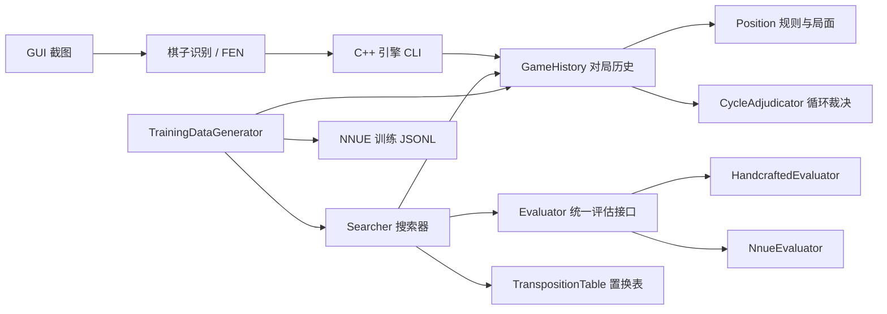

# Chinese Chess AI

一个从零实现的中国象棋 AI 项目。目前仓库包含一套可独立运行的 C++20
象棋内核：它能够解析局面、生成合法走法、执行和撤销走法、维护对局历史，
并使用手工评估或 HalfKA NNUE 模型与 Alpha-Beta 搜索选择着法。

项目的目标不是调用现成象棋引擎，而是逐步完成一套自己的 AI：先建立可靠的
规则与传统搜索基线，再加入神经网络训练和推理，最后通过独立的 GUI 适配层与
棋盘界面交互。

> 当前状态：规则引擎、手工评估、Negamax、Alpha-Beta/PVS、静态搜索、迭代加深、
> 置换表、“三次重复、长将、长捉、无吃子”的简化裁决，以及 float32 NNUE
> 前向推理、搜索内增量累加器、C++ 自我对弈数据生成和 Python 监督训练/导出
> 流水线均已实现，并可自动连续执行多代训练。另有第一版跨平台 GUI 适配层，
> 可枚举微信窗口、截图、标定棋盘、识别棋子、生成 FEN、调用 C++ 引擎分析并
> 预览坐标。只读观察器还能以连续稳定帧推断合法走法，并通过常驻协议维护完整
> `GameHistory`。连续控制器已支持单次落子请求、视觉结果确认、确认超时及异常
> 安全暂停、分类诊断和显式人工恢复，搜索也可按每步毫秒预算中止当前迭代；棋力
> 对局晋升、大规模并行生成和量化优化尚未实现。

## 项目结构

```text
chinese-cheese-ai/
├── engine/
│   ├── include/xiangqi/
│   │   ├── types.hpp                 # 棋子、颜色、坐标和走法等基础类型
│   │   ├── position.hpp              # 局面、FEN、走法生成、执行与撤销
│   │   ├── game_history.hpp          # 对局记录和历史局面维护
│   │   ├── cycle_adjudicator.hpp     # 三次重复、长将、长捉和无吃子裁决
│   │   ├── evaluation.hpp            # 统一评估接口与手工局面评估
│   │   ├── halfka.hpp                 # NNUE HalfKA 稀疏输入特征
│   │   ├── move_ordering.hpp         # SEE、Killer、Counter 与多层 History 排序
│   │   ├── nnue.hpp                  # NNUE 权重、加载、累加与推理
│   │   ├── search.hpp                # Negamax、Alpha-Beta 和迭代加深
│   │   ├── training_data.hpp         # FEN 标注与自我对弈数据生成
│   │   └── transposition_table.hpp   # 置换表
│   ├── src/                          # 各模块的 C++ 实现和命令行程序
│   └── tests/
│       └── rules_tests.cpp           # 规则、历史、评估和搜索测试
├── training/
│   ├── halfka.py                     # 与 C++ 一致的 HalfKA 特征编码
│   ├── model.py                      # PyTorch NNUE 网络与稀疏批处理
│   ├── dataset.py                    # JSONL 训练样本加载
│   ├── train.py                      # 训练、验证、检查点和续训
│   ├── iterate.py                    # 多代数据生成、回放训练、导出和恢复
│   ├── export_nnue.py                # 导出 XQNNUEF1 权重
│   ├── verify_cpp.py                 # Python/C++ 推理一致性验证
│   ├── examples/positions.fen        # 批量标注输入示例
│   └── tests/                        # Python 训练端自动测试
├── gui/
│   ├── windows.py                    # macOS/Windows 窗口枚举与激活
│   ├── capture.py                    # 跨平台窗口区域截图
│   ├── geometry.py                   # 棋盘标定和引擎/屏幕坐标换算
│   ├── control.py                    # 安全预览和鼠标点击
│   ├── config.py                     # 标定配置持久化
│   ├── recognition.py                # 棋子模板学习、识别、FEN 和叠加图
│   ├── engine_client.py              # Python 到 C++ 引擎的只读分析桥接
│   ├── protocol_client.py            # 保存完整历史的 C++ 常驻协议客户端
│   ├── board_state.py                # 稳定帧门槛和前后局面合法差分
│   ├── observer.py                   # 连续局面、历史与搜索建议编排
│   ├── game_controller.py            # 对局状态机、单步执行与视觉确认
│   ├── cli.py                        # 截图、标定、识别、观察和预览命令行
│   └── tests/                        # GUI 坐标单元测试
├── .vscode/                          # VS Code 构建、测试和调试配置
├── CMakeLists.txt                    # CMake 构建配置
├── Makefile                          # Make 构建配置
└── compile_flags.txt                 # clangd 编译参数
```

各模块之间的关系如下：


```mermaid
flowchart LR
    UI["GUI 截图"] --> CV["棋子识别 / FEN"]
    CV --> CLI["C++ 引擎 CLI"]
    CLI --> GH["GameHistory 对局历史"]
    SEARCH["Searcher 搜索器"] --> GH
    GH --> POS["Position 规则与局面"]
    GH --> CA["CycleAdjudicator 循环裁决"]
    SEARCH --> EVAL["Evaluator 统一评估接口"]
    EVAL --> HCE["HandcraftedEvaluator"]
    EVAL --> NN["NnueEvaluator"]
    SEARCH --> TT["TranspositionTable 置换表"]
    DATA["TrainingDataGenerator"] --> SEARCH
    DATA --> GH
    DATA --> JSONL["NNUE 训练 JSONL"]
```

## GUI 适配层：微信窗口截图与棋盘坐标操作

GUI 适配层使用 Python 实现，与 C++ 引擎保持隔离。macOS 通过 Quartz/Cocoa 和
ApplicationServices 查找、按窗口 ID 截图并精确置顶目标窗口，即使微信被其他窗口
遮挡也不会截到遮挡内容；Windows 通过 Win32 API 定位和激活窗口，并使用 `mss`
截图。鼠标控制使用 `pyautogui`。棋盘四角保存为窗口内的归一化坐标，因此窗口平移
以及等比例缩放后不需要重新标定。Retina 或 Windows DPI 导致截图像素与屏幕坐标
不同的情况，也会在预览时按实际宽高比例换算。

创建环境并安装依赖：

```bash
python3 -m venv .venv
.venv/bin/python -m pip install -r gui/requirements.txt
```

Windows PowerShell 中将第二条命令改为：

```powershell
.venv\Scripts\python.exe -m pip install -r gui\requirements.txt
```

macOS 需要在“系统设置 → 隐私与安全性”中，为实际启动 Python 的 Terminal、
iTerm 或 IDE 开启“屏幕录制”和“辅助功能”，随后完全退出并重新打开该应用。
Windows 如果微信以管理员身份运行，控制程序通常也需要相同权限级别。

先在微信中打开象棋小程序，然后执行：

```bash
# 查看匹配窗口；有多个结果时记住左侧序号
.venv/bin/python -m gui.cli windows --query 微信

# 截图验证窗口选择，必要时通过 --index 1 选择第二个结果
.venv/bin/python -m gui.cli capture --query 微信 --index 0

# 依次点击棋盘左上、右上、右下、左下四个最外侧交叉点
.venv/bin/python -m gui.cli calibrate --query 微信 --index 0 --orientation red-bottom

# 在新截图中画出 b0c2 的起点、终点和箭头，不操作微信
.venv/bin/python -m gui.cli preview --move b0c2

# 默认只输出坐标，不点击第三方界面
.venv/bin/python -m gui.cli move --move b0c2
```

如果自己位于黑方、棋盘在屏幕中旋转了 180°，标定时使用
`--orientation black-bottom`。标定窗口按 `R` 可以清空重选，按 `Esc` 取消。
代码仍保留显式 `--execute` 点击开关，供自建离线测试界面使用。微信规则可能将
未经授权的自动化操作视为异常行为，因此默认工作流只截图、识别和提示走法，不在
真实微信账号上使用该开关。

### 棋子识别与引擎建议

第一版识别器使用轻量传统视觉，不需要额外训练模型。先从一张同主题、同朝向的
标准初始局面生成本地模板：

```bash
.venv/bin/python -m gui.cli learn-templates \
  --image gui/output/window.png \
  --output gui/templates/jj_default.npz
```

识别器在 90 个交叉点上先以 HSV 饱和度检测金色棋子外圈，再根据棋子中心颜色区分
红黑阵营，最后只在对应阵营的七类灰度字形模板中执行归一化相关匹配。标定坐标本身
已经处理棋盘朝向，因此输出可以直接按从黑方底线到红方底线的顺序压缩成 FEN。
占位检测会在每个交叉点周围不足五分之一格的范围内寻找金色圆环响应最高的位置，
再以找到的实际中心进行阵营和字形识别，因此可以容忍 JJ 选中动画造成的轻微上浮。

对一张本地截图进行离线识别，并调用现有 C++ 引擎搜索：

```bash
.venv/bin/python -m gui.cli recognize \
  --image gui/output/after_move.png \
  --side black \
  --engine build/make/xiangqi_cli \
  --depth 3 \
  --json gui/output/recognized.json
```

省略 `--image` 时会只读截取当前匹配窗口。`--side` 必须显式指定，因为仅凭静态
棋盘无法可靠判断当前轮到哪一方。任何低于置信度阈值的棋子都会标为 `?` 并阻止
生成 FEN，避免把不可靠局面交给引擎。

### 连续局面观察与完整历史

`xiangqi_protocol` 是常驻 C++ 进程，支持 `position fen`、`state`、`result`、
`legal`、`move`、`undo`、`go depth N [movetime M]` 和 `quit` 等单行命令。它只在设置起始 FEN 时清空
历史，之后每个通过视觉差分确认的合法着都由 `GameHistory::play()` 追加。因此
三次重复、长将、长捉和无吃子计数不会像“每帧重新载入 FEN”那样丢失。

GUI 在每个稳定局面后先发送 `result`。C++ 直接复用已有的基础终局和历史裁决器，
返回 `ongoing`、`red_win`、`black_win` 或 `draw`，并附带 `checkmate`、
`no_legal_move`、`threefold_repetition`、`red_perpetual_check`、
`black_perpetual_chase`、`no_capture_120_plies` 等原因。只有结果仍为 `ongoing` 时才
继续搜索，控制器因此可以输出明确的胜负或和棋原因，而不是从 `bestmove none` 猜测。

只读观察器要求同一识别局面连续出现多帧才接受，随后比较前后90格：普通走法和
吃子都必须恰好改变起点、终点两个格子，推断出的走法还必须存在于 C++ 返回的合法
着列表中。识别噪声不会推进引擎历史。

使用本地截图序列安全回放：

```bash
.venv/bin/python -m gui.cli observe \
  --image-dir gui/examples/frames \
  --repeat-each 3 \
  --stable-frames 3 \
  --side red \
  --protocol build/make/xiangqi_protocol \
  --depth 16 \
  --move-time-ms 1000
```

`observe --live` 可以持续执行只读窗口截图，但第三方平台可能限制未经授权的自动化
访问。建议只在自建离线棋盘或获得明确许可的环境使用；观察器本身不包含鼠标点击。

### 连续对局控制器

`control` 将观察器、引擎搜索和单步执行串成状态机。每次只允许提交一个 AI 走法，
随后通过新的稳定棋盘确认真实结果。通常控制器先确认 AI 走法，再等待并解析对手
应手；如果对手走得很快，首个稳定画面已经跨过连续两个半回合，控制器会启用双步
追赶：先用待确认的 AI 走法建立中间局面，再利用 C++ 合法着列表从最终画面唯一解析
对手应手，验证两个引擎局面都与视觉棋盘一致后，原子地把两步写入 `GameHistory`。
日志会依次显示 `[confirmed]` 和带有 `(two-ply recovery)` 标记的 `[opponent]`。

双步追赶失败不会猜测走法，写入的临时历史也会全部撤销。识别不一致、窗口消失、
执行异常或超过 `--confirmation-frames` 仍未确认时都会立即暂停，而且不会自动重试
点击。

视觉稳定和规则稳定是两个独立门槛。连续帧相同只产生候选棋盘；候选相对最近可信
棋盘仅变化一个格子时，不可能构成完整象棋走法，因此会作为选中状态或动画中间帧
忽略，且不会覆盖可信棋盘或写入 `GameHistory`。日志首次看到该候选时会输出具体格子，
例如 `[transient] one-square intermediate ignored: i9 r->.`；等起点和终点都稳定出现后，
仍按 C++ 合法着列表验证并提交完整走法。其他无法由单步或双步追赶解释的稳定局面
继续安全暂停，并在错误信息中列出全部逐格变化。

落子光效也可能让最终局面的个别棋子持续低置信度并标为 `?`。稳定器允许这种部分
可观察棋盘进入规则层；连续帧只要在双方都已知的格子上不冲突，就会视为同一候选，
并使用各帧的已知结果互相补全变化中的 `?`。若正在确认 AI 走法，观察器会先应用
已知的待确认走法，再枚举全部合法应手，把 `?` 当作未知而不是空位，并用其余已知格
过滤候选。只有恰好一个
合法应手匹配且至少有两个已知变化格作为证据时，才会补全完整引擎局面并原子提交
两步；零个或多个候选都只作为中间画面继续等待。该机制可以处理连续吃子导致最终
只净变化三格，以及快速应手时落点仍被光效遮挡的情况。

快速应手恢复不要求整张棋盘先连续稳定。等待 AI 落子确认期间，每一帧都会先尝试
“已知 AI 走法 + 唯一合法应手”的规则匹配；只要某一帧提供了足够证据并唯一对应一条
合法序列，就会立即确认。动画假帧、错误有效标签或候选不唯一的帧不会提交，仍交给
常规多帧稳定器继续观察。这避免闪烁光效在多个互不兼容的视觉结果间切换，从而始终
无法累计到 `--stable-frames` 的问题。

AI 走法已经确认、正在等待对手时，也会逐帧尝试从部分棋盘推断唯一合法着。
例如提示圈让无关的 `c9`、`h9` 两个空格被识别为 `?`，但 `h7` 的黑炮消失、
`f7` 出现黑炮时，规则层仍可唯一确认 `h7f7`，并用引擎局面补全未知格。
至少需要两个已知变化格；证据不足或存在多个匹配合法着时继续等待，不写入历史。

先用完整的本地截图序列验证闭环；序列中的 AI 走法必须与当前引擎搜索结果一致：

```bash
.venv/bin/python -m gui.cli control \
  --image-dir gui/examples/game-frames \
  --repeat-each 3 \
  --stable-frames 3 \
  --side red \
  --ai-side red \
  --protocol build/make/xiangqi_protocol \
  --depth 16 \
  --move-time-ms 1000
```

`--depth` 是允许达到的最大深度，`--move-time-ms` 是每步总思考预算。搜索到期时会
通过内部超时信号退出当前未完成迭代，逐层撤销临时走法，并返回上一个完整深度的
最佳着；如果第一层也未完成，则返回一个合法兜底着。协议中的 `timedout 1` 会继续
传到观察器和控制器日志。超时不会修改真实 `GameHistory`。

实时模式默认也只换算和预览坐标，用户可以手动执行建议着并让程序验证结果。只有
额外传入 `--execute` 才会启用鼠标点击；该选项仅应在自建离线棋盘或明确允许自动化
的环境使用。项目不会自动绕过平台限制。

加入 `--interactive-recovery` 后，控制器会把暂停原因标记为
`recognition_rejected`、`confirmation_timeout`、`move_mismatch` 或
`executor_failed`，并且只显示当前状态允许的恢复操作：

- `r=resume waiting`：用于识别噪声或确认超时，清零等待计数后继续观察，绝不重复
  发送上一次点击。
- `a=accept observed legal move`：实际走法与预期不同时，接受已经由 C++ 合法着列表
  验证并写入 `GameHistory` 的实际走法。
- `q=quit`：保持暂停并退出循环。

执行器失败等无法证明状态一致的情况不提供恢复选项，必须停止后人工检查。默认不加
该参数时仍然是“遇到异常立即停止”。这套恢复不会清空历史，也不包含悔棋或重新开局。

## 技术栈

- 引擎：C++20、CMake/Make、Zobrist、Negamax、Alpha-Beta/PVS、NNUE。
- 训练：Python、PyTorch、NumPy、JSONL、AdamW。
- 图像处理：Python、OpenCV、NumPy、HSV 占位检测、模板相关匹配。
- macOS：PyObjC、Quartz、Cocoa、ApplicationServices，支持按窗口 ID 截图和
  `AXRaise` 精确置顶。
- Windows：pywin32、Win32 窗口 API、`mss` 截图。
- 输入控制：`pyautogui`，默认关闭真实点击。
- 数据交换：FEN、JSON、NPZ、标准输入输出，以及自定义 `XQNNUEF1` 权重格式。
- 进程通信：单行请求/响应协议，Python `subprocess.Popen` 保持 C++
  `GameHistory` 和置换表长期存活。
- 测试：C++/CTest 与 Python `unittest`。

## 实现思路

### 1. 局面表示与合法走法

棋盘使用 90 个格子的紧凑数组保存，并额外记录当前行棋方和 Zobrist 哈希。
每种棋子分别生成伪合法走法，再统一执行一次走法并检查己方将帅是否受到攻击，
从而过滤出真正的合法走法。

规则层已经处理：

- 车的直线移动与阻挡
- 马腿
- 炮架和吃子规则
- 象眼、河界
- 士和将帅的九宫限制
- 兵卒过河前后的移动差异
- 将帅照面
- 将军、将死和困毙
- 禁止任何使己方将帅仍处于被将状态的走法

走法执行采用 `do_move` / `undo_move` 对称设计。撤销信息会保存被吃棋子、
原行棋方和原哈希等状态，因此搜索可以在同一个局面对象上反复试走，而无须在
每个节点复制整张棋盘。

### 2. 局面哈希与对局历史

局面使用增量 Zobrist 哈希，哈希值同时包含棋子位置和当前行棋方。执行或撤销
走法时只更新发生变化的部分，用于快速识别重复局面和查询置换表。

`GameHistory` 在每个半回合记录：

- 走法及其撤销信息
- 行棋方、移动棋子和被吃棋子
- 该步是否造成将军
- 走子前后的局面哈希
- 连续未吃子半回合数

历史裁决器采用当前项目约定的简化规则：

- 同一局面（包括轮到哪一方走）出现三次时进行裁决。
- 如果重复区间内只有一方在自己的每一步都连续将军，则长将方判负。
- 如果没有将军步骤，且只有一方每一步都新产生了对同一棋子的真捉，则长捉方判负。
- 其余三次重复判和。
- 连续 120 个半回合，也就是 60 个整回合没有吃子时判和。

长捉采用 Pikafish 风格的简化判断：裁决时临时给棋子分配稳定 ID，逐步倒退重复
区间，计算每一步“走后真捉集合减去走前真捉集合”，再对同一方的所有步骤取交集。
合法反吃可保护目标；弱子捉强子按例外处理；将帅和兵卒作为追逐者不判违规长捉，
未过河兵卒也不作为长捉目标。循环内夹杂将军但不构成纯长将时，目前仍然判和。

### 3. 手工评估函数

评估值以红方减黑方表示，并在搜索入口转换为当前行棋方视角。当前评估由两部分
组成：

- 基础子力价值
- 简单位置价值，包括中心控制、兵卒推进和过河奖励

手工评估的作用是先为搜索建立一个可解释、可测试的基线。未来加入神经网络后，
仍可用它检查训练结果、生成对照数据，或与神经网络评估混合使用。

### 4. HalfKA 神经网络输入

第一版 NNUE 采用包含将帅的 HalfKA 稀疏输入。红黑双方分别拥有一个观察视角；
黑方视角将棋盘旋转 180 度，使观察方始终位于棋盘下方。每个在盘棋子激活一个
如下形式的特征：

```text
(观察方将帅九宫位置桶, 棋子相对阵营与类型, 标准方向棋子位置)
```

观察方将帅有 9 个合法九宫位置，棋子通道由己方和对方各 7 种棋子组成，棋盘有
90 个位置，所以每个视角的输入维度是 `9 × 14 × 90 = 11340`。它是稀疏的 0/1
向量：标准初始局面虽然有 11340 维，但每个视角只激活 32 项。双方将帅也作为
普通棋子特征被显式包含，这是 HalfKA 与 HalfKP 的主要区别。

当前 C++ 推理网络固定为：

```text
HalfKA 11340 → 共享特征变换 256
红黑累加器按评分视角拼接 256 + 256 = 512
ClippedReLU → 全连接 32 → ClippedReLU → 输出 1
```

`NnueNetwork` 能从局面完整计算双方累加器、执行 float32 前向传播并加载或保存
版本化二进制权重。`NnueEvaluator` 已接入搜索器的统一评估接口。网络输出直接以
引擎分值为单位，并限制在 ±28000 内，避免与搜索器的将杀分数范围冲突。

权重文件统一使用小端编码，头部依次为 8 字节魔数 `XQNNUEF1`，以及版本、输入
维度、累加器宽度和隐藏层宽度四个 `uint32`。后续数据均为 float32，排列顺序为：

```text
feature_bias[256]
feature_weights[11340][256]
hidden_bias[32]
hidden_weights[32][512]
output_bias[1]
output_weights[32]
```

搜索开始时会为根局面全量刷新一次红黑累加器。随后普通走子通过减去旧位置特征、
加入新位置特征并移除被吃棋子完成增量更新；观察方自己的将帅移动会改变全部
HalfKA 特征的将帅桶，因此只全量刷新该方累加器。每层搜索保存累加器快照，撤销
走法时精确恢复。叶子节点直接从缓存的两个累加器执行 `512→32→1`，不再扫描棋盘
调用 `refresh_accumulator()`。

### 5. Python NNUE 训练端

Python 使用 PyTorch 描述与 C++ 完全相同的网络。批处理只保存每个局面的激活特征
编号并对相应权重行求和，不会构造 `batch × 11340` 的稠密输入。训练样本采用
JSON Lines，每行至少包含 FEN 和当前行棋方视角的引擎分值：

```json
{"fen":"4k4/9/9/9/4p4/9/9/4R4/9/4K4 w","score":780,"weight":1.5}
```

`score` 会被限制到 ±28000；可选的正数 `weight` 用于调整单条样本的损失权重。
训练使用带样本权重的 Smooth L1 损失和 AdamW，检查点保存模型、优化器、轮次、
验证损失及架构元数据。导出器只提取推理参数，并按 C++ 已实现的 `XQNNUEF1`
小端格式写出。

`verify_cpp.py` 会临时导出模型，针对相同 FEN 分别执行 PyTorch 和 C++ 原始
float32 前向传播，然后检查误差是否在容差内。这可以尽早发现特征方向、矩阵转置、
拼接顺序或权重排列不一致的问题。

### 6. 训练数据生成

`xiangqi_generate_data` 使用现有手工评估搜索器生成 Python 训练端可以直接读取的
JSONL。它提供两种互补模式：

- `label`：从纯文本文件逐行读取 FEN，以固定深度搜索分数批量标注。
- `selfplay`：从标准初始局面完整对弈，在开局、中局和残局按随机间隔采样。

首代可以使用手工评估教师；传入 `--nnue MODEL` 后，走棋与标签搜索会改用指定
NNUE，因此训练完成的上一代模型可以为下一代制造局面和监督分数。

自我对弈的前若干半回合不会从全部合法着中盲目随机，而是分别搜索根节点候选，
只在评分距离最佳着不超过给定阈值的 Top-K 走法中随机选择。开局阶段结束后恢复
始终选择最佳着。这样既能让对局进入不同中盘，又不会因为随手送子而产生大量失真
局面。每条样本的 `score` 都是当前行棋方视角，默认过滤进入将杀区间的极端分数，
并按包含行棋方的 Zobrist 哈希去重。

生成器依据剩余非将帅子力将样本粗分为 `opening`、`middlegame` 和 `endgame`。
自我对弈样本还会附带 `game`、`ply`，自然结束的对局会写入当前行棋方视角的
最终 `result` 元数据；达到最大半回合数而截断的对局不会伪造和棋结果。
Python 第一版训练器会忽略这些额外字段，后续可用于混合搜索分数与对局结果。
实际走子始终写入 `GameHistory`，因此三次重复、长将、长捉和 60 回合无吃子裁决
会参与对局和搜索。历史规则导致的终局不会作为仅含棋盘特征的 NNUE 标签写入。

`training.iterate` 把多代流程串成一个可恢复任务：每一代先用当前冠军生成新数据，
再联合最近若干代数据进行回放训练，随后导出 C++ 权重并执行 Python/C++ 数值一致性
验证。只有全部步骤成功才会原子更新 `state.json` 和稳定的 `champion.*` 文件；作业
被 Slurm 超时终止后，使用相同工作目录重新运行即可从未完成代继续。

当前自动晋升只保证文件完整和跨语言推理一致，并没有证明候选棋力更强。正式多代
训练前仍需实现候选模型与冠军模型的自动对局门禁；在此之前建议限制代数并人工检查
每一代结果，避免把偶然退步无限放大。

### 7. Negamax 与 Alpha-Beta/PVS 搜索

双方对称的零和搜索被写成 Negamax 形式：当前节点的分数等于对手子节点分数的
相反数。在此基础上使用 Alpha-Beta 窗口剪掉不可能影响最终选择的分支。

Alpha-Beta 路线进一步使用 PVS：排序后的第一候选着以完整窗口搜索，建立可靠的
`alpha`；后续着先用 `[alpha, alpha + 1]` 零窗口判断能否超过当前最佳分数。
不能超过时直接使用边界结果；超过 `alpha` 但未达到 `beta` 时再以完整窗口重搜；
达到 `beta` 时直接截断。搜索结果会统计零窗口提高 `alpha` 后的完整重搜次数。

仓库同时保留无剪枝 Negamax，便于对照验证 Alpha-Beta 的结果是否正确。搜索器
还会统计主搜索节点、静态搜索节点、剪枝次数和置换表命中次数。

### 8. 静态搜索

固定深度搜索如果正好停在一次交换中间，评估会产生明显波动。静态搜索会在叶子
节点继续搜索吃子着，直到局面相对稳定；如果当前正被将军，则搜索全部合法应将，
避免直接评估一个尚未处理的将军局面。

### 9. 迭代加深与置换表

迭代加深依次搜索深度 1、2、3……，每完成一层就保留该层的最佳着法、评分和
统计信息。这为后续加入限时搜索打下基础，也能为更深一层提供较好的着法顺序。

置换表使用完整 Zobrist 键识别同一局面，缓存以下内容：

- 搜索深度
- 分数
- `EXACT`、`LOWER` 或 `UPPER` 边界类型
- 该局面的最佳着法
- 用于替换策略的搜索代际

搜索命中缓存后，可以在边界满足当前窗口时直接返回结果；深度不足或边界不能
截断时，仍会优先搜索缓存中的最佳着法。将杀分数在存取时进行距离归一化，确保
同一局面出现在不同搜索层级时仍然保持“更快将死更好、越晚被将死越好”的顺序。

主搜索的走法顺序依次为：置换表或上一轮 PV 最佳着、SEE 非负的有利吃子、
安全的非吃子将军、同层两个 Killer、针对上一手的 Counter Move、按成功记录
排列的 History 安静着，以及 SEE 为负的亏损吃子。普通安静着同时使用
`side + from + to` 的 Main History 和 `piece + to` 的 Piece-to History：前者
保留具体路线经验，后者区分棋子类型并把相同棋子走到同一目标格的经验跨起点共享。
MVV-LVA 和 SEE 使用手工
评估器统一提供的基础子力价值；安静着造成 Beta 截断时会更新 Killer、Counter
和两类 History，并对同节点先前失败的安静着降低历史分。

当前 SEE 采用正确性优先的实现：在固定目标格上交替寻找最低价值的合法反吃者，
每一层重新生成合法走法，因此能够自然处理炮架变化、马腿、牵制、将帅照面和
将帅落点安全。它只用于排序，不会删除亏损吃子，完整搜索仍然负责发现弃子攻杀。

搜索器通过统一的 `Evaluator` 接口获取叶子评分。每次搜索由评估器创建独立的
`EvaluationState`，搜索器执行和撤销走法时同步调用其 `push_move` / `pop_move`。
默认 `HandcraftedEvaluator` 使用无状态适配器；`NnueEvaluator` 使用包含双累加器
和撤销栈的 `NnueEvaluationState`，因此同一份只读网络权重可以安全服务不同搜索。

搜索器以 `GameHistory` 维护每条递归路径，在主搜索与静态搜索节点进入时裁决
重复、长将、长捉和 60 回合规则。规则胜负转换为带距离的将杀分，和棋为 0。
置换表键同时混合棋盘哈希与增量规则上下文哈希，避免相同棋盘在不同历史下分别
属于正常局面、重复和棋或违规判负时错误复用缓存分数。

## 已实现功能

### 规则与局面

- [x] 90 格棋盘、棋子、坐标和走法表示
- [x] 中国象棋 FEN 解析与输出
- [x] 七类棋子的伪合法走法生成
- [x] 将军检测和合法走法过滤
- [x] 走法执行与无损撤销
- [x] 将死和困毙判断
- [x] 增量 Zobrist 哈希

### 历史与裁决

- [x] 完整走法历史和连续撤销
- [x] 吃子、将军和未吃子计数元数据
- [x] 历史局面哈希时间线和重复次数统计
- [x] 三次相同局面判和
- [x] 单方连续长将判负
- [x] 稳定棋子 ID 与单步新增真捉检测
- [x] 单方持续长捉同一棋子判负
- [x] 将帅、兵卒、受保护目标和对称互捉例外
- [x] 120 个半回合未吃子判和
- [x] 将历史裁决接入主搜索与静态搜索
- [x] 路径相关的置换表上下文隔离

### 评估与搜索

- [x] 可解释的手工评估函数
- [x] 可注入的 `Evaluator` / `HandcraftedEvaluator` 统一评估接口
- [x] HalfKA 双视角稀疏特征编号与提取
- [x] float32 NNUE 全量累加、ClippedReLU 与前向推理
- [x] 搜索路径内的 HalfKA 增量累加器与撤销栈
- [x] 将帅换桶刷新和普通走子/吃子差量更新
- [x] 版本化小端 NNUE 权重加载与保存
- [x] 可注入搜索器的 `NnueEvaluator`
- [x] Python/PyTorch 同构 NNUE 网络和稀疏批处理
- [x] JSONL 监督训练、验证、检查点和续训
- [x] `XQNNUEF1` 权重导出与 Python/C++ 一致性验证
- [x] 纯文本 FEN 固定深度批量标注
- [x] 带近似最佳开局随机性的完整自我对弈数据生成
- [x] 局面阶段标记、哈希去重、极端分数过滤和对局结果元数据
- [x] NNUE 教师自我对弈和最近多代数据回放
- [x] 带原子状态、断点恢复、导出验证与自动晋升的迭代脚本
- [x] 固定深度 Negamax
- [x] Alpha-Beta 剪枝
- [x] PVS 零窗口试探与必要的完整窗口重搜
- [x] 与评估器子力价值一致的 MVV-LVA 与 SEE 吃子分类
- [x] 安全将军着优先
- [x] 第一、第二 Killer Move
- [x] Counter Move、Main History 与 Piece-to History
- [x] 静态搜索和被将时的应将搜索
- [x] 迭代加深
- [x] 固定容量置换表
- [x] `EXACT` / `LOWER` / `UPPER` 边界缓存
- [x] 哈希着法排序、代际替换和节点统计

### 工程支持

- [x] Make 和 CMake 构建
- [x] 命令行局面展示与搜索演示
- [x] VS Code 构建、测试和调试配置
- [x] Perft、规则、历史裁决、评估和搜索自动测试
- [x] Python 特征、反向传播、导出和跨语言推理测试
- [x] macOS/Windows 微信窗口枚举、截图和激活适配
- [x] 棋盘四角标定、DPI 坐标换算、走法预览和显式点击
- [x] GUI 坐标与配置读写自动测试
- [x] HSV 棋子占位检测、红黑分类和十四类模板识别
- [x] 识别结果叠加图、FEN 生成和低置信度阻断
- [x] 识别局面到 C++ 搜索器的只读分析桥接
- [x] 保存完整 `GameHistory` 的 C++ 常驻协议
- [x] 连续稳定帧、普通走法/吃子差分和 C++ 合法着校验
- [x] 离线截图序列与只读实时观察器
- [x] 平台无关的连续对局状态机、单次落子请求与视觉结果确认
- [x] 连续控制器接入离线截图序列和实时窗口循环，真实点击保持显式关闭
- [x] 执行结果不一致、确认超时、窗口或执行异常时安全暂停
- [x] C++ 终局裁决协议及 GUI 胜负、和棋原因传递
- [x] 迭代加深毫秒时间预算、异常安全撤销和 GUI 每步时间参数
- [x] GUI 暂停原因分类、人工继续等待及接受已验证实际走法

## 尚未实现

- [ ] 完整竞赛版长捉语义及“一将一捉”等复杂循环责任
- [ ] LMR、空步裁剪和期望窗口等搜索增强
- [ ] NNUE SIMD 与整数量化优化
- [ ] 多进程分片生成、断点续写和大规模数据集管理
- [ ] 真实棋谱解析与中残局数据补充
- [ ] 候选模型对冠军模型的自动对局和统计晋升门禁
- [ ] UCCI 等标准引擎通信协议
- [ ] 窗口中断后的人工恢复（悔棋和重新开局同步暂缓实现）
- [ ] 多主题、多分辨率模板管理与神经网络视觉识别后端
- [ ] 在自建离线棋盘上完成一局真实点击端到端验收

当前 `Searcher` 同时支持从 `Position` 或带有真实对局路径的 `GameHistory` 开始
搜索。需要依据此前棋谱裁决重复时，应使用后者；仅传入 `Position` 时，搜索器会
创建以该局面为起点的新历史，无法获知调用前已经发生的走法。

## 构建与测试

要求支持 C++20 的编译器。核心引擎不依赖第三方库。

使用 Make：

```bash
make
make test
make run
```

使用 CMake：

```bash
cmake -S . -B build
cmake --build build
ctest --test-dir build --output-on-failure
```

安装 Python 训练依赖并运行训练端测试：

```bash
python3 -m pip install -r training/requirements.txt
make python-test
```

从纯文本 FEN 列表生成搜索标签：

```bash
./build/make/xiangqi_generate_data label \
  --input training/examples/positions.fen \
  --output training/runs/labeled.jsonl \
  --depth 6
```

生成包含开局、中局和残局采样的自我对弈数据：

```bash
./build/make/xiangqi_generate_data selfplay \
  --output training/runs/selfplay.jsonl \
  --games 1000 \
  --play-depth 4 \
  --label-depth 6 \
  --random-plies 10 \
  --random-top-k 3 \
  --random-margin 150 \
  --seed 1
```

输出文件默认必须不存在，防止误覆盖已有训练数据；需要向已有 JSONL 继续追加时
显式传入 `--append`。使用 `--help` 可以查看采样间隔、最大半回合数、分数过滤和
置换表容量等全部参数。

从手工评估教师开始，自动运行三代小规模迭代：

```bash
python3 -u -m training.iterate \
  --work-dir training/runs/iterations \
  --generations 3 \
  --games-per-generation 20 \
  --play-depth 2 \
  --label-depth 4 \
  --epochs-per-generation 10 \
  --replay-generations 3 \
  --batch-size 256 \
  --device cpu
```

如果要从已经完成的 `nnue-1` 开始，首次运行额外传入：

```bash
python3 -u -m training.iterate \
  --work-dir training/runs/iterations \
  --generations 3 \
  --bootstrap-checkpoint training/runs/nnue-1/best.pt \
  --bootstrap-model training/runs/nnue-1/best.nnue \
  --device cuda
```

`--generations` 表示本次调用新增完成多少代，而不是总目标代数。后续续跑时使用相同
`--work-dir`，不要再次传入 bootstrap 参数；脚本会读取 `state.json`，自动选择
上一代不可变检查点和模型。服务器任务被中断后也使用同一条续跑命令。

使用仓库中的微型示例验证训练闭环：

```bash
python3 -m training.train training/examples/tiny.jsonl \
  --output-dir training/runs/example \
  --epochs 1 \
  --batch-size 2

python3 -m training.export_nnue \
  training/runs/example/best.pt \
  training/runs/example/best.nnue

python3 -m training.verify_cpp \
  training/runs/example/best.pt \
  --engine build/make/xiangqi_cli
```

示例数据只用于检查代码能否运行，不能训练出具有棋力的模型。`--resume` 可从
`latest.pt` 继续训练；`--epochs` 表示续训后希望达到的总轮次。

## 命令行使用

使用 Make 构建后，可以查看初始局面并列出合法走法：

```bash
./build/make/xiangqi_cli
```

运行四层迭代加深 Alpha-Beta 搜索：

```bash
./build/make/xiangqi_cli --depth 4
```

使用无剪枝 Negamax 作为对照：

```bash
./build/make/xiangqi_cli --depth 3 --negamax
```

加载已经导出的 NNUE 权重并用于评估和搜索：

```bash
./build/make/xiangqi_cli --nnue model.nnue --depth 4
```

输出供跨语言验证使用的未取整 NNUE 分数：

```bash
./build/make/xiangqi_cli --nnue model.nnue --nnue-raw
```

载入指定 FEN：

```bash
./build/make/xiangqi_cli \
  --fen "4k4/9/9/9/9/4R4/9/9/9/4K4 w" \
  --depth 4
```

命令行会输出棋盘、当前评估器与评分、合法走法，以及每一层迭代加深的最佳着、
分数、节点数、剪枝数和置换表统计。

## 坐标约定

坐标范围为 `a0` 到 `i9`，红方底线是第 0 行，黑方底线是第 9 行。走法使用
“起点 + 终点”的四字符格式，例如：

```text
b0c2
```

表示红方初始位置的马从 `b0` 走到 `c2`，即常见记谱中的“马二进三”。

## 后续路线

1. 用更多真实棋例校准长捉例外，并扩展“一将一捉”等复杂循环责任。
2. 完善着法排序和搜索剪枝，并根据整局剩余时间动态分配已实现的每步搜索预算。
3. 为数据生成加入多进程分片、断点续写，并通过棋谱解析补充高质量中残局。
4. 对训练模型进行量化和 SIMD 推理优化，并通过对局评估棋力。
5. 在自建离线棋盘中验收连续截图、单次点击、视觉确认、人工恢复和异常暂停，并完善
   终局界面提示。悔棋和重新开局同步暂缓实现。

将规则引擎、AI 搜索和 GUI 自动化分层，可以让棋力逻辑不依赖某个具体界面，
也便于分别测试、调优和替换各个模块。
