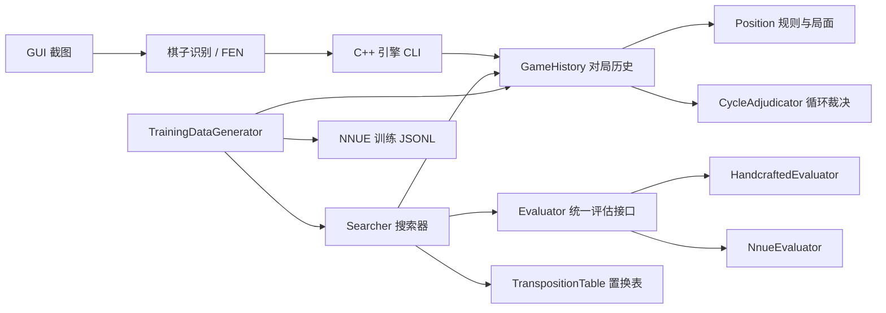

# Chinese Chess AI

一个从零实现的中国象棋 AI 项目。目前仓库包含一套可独立运行的 C++20
象棋内核：它能够解析局面、生成合法走法、执行和撤销走法、维护对局历史，
并使用手工评估或 HalfKA NNUE 模型与 Alpha-Beta 搜索选择着法。

项目的目标不是调用现成象棋引擎，而是逐步完成一套自己的 AI：先建立可靠的
规则与传统搜索基线，再加入神经网络训练和推理，最后通过独立的 GUI 适配层与
棋盘界面交互。

> 当前状态：规则引擎、手工评估、Negamax、Alpha-Beta/PVS、静态搜索、迭代加深、
> 置换表、“三次重复、长将、长捉、无吃子”的简化裁决，以及 float32 NNUE
> 前向推理、搜索内增量累加器、C++ 自我对弈数据生成和 Python 监督训练/导出
> 流水线均已实现，并可自动连续执行多代训练。另有第一版跨平台 GUI 适配层，
> 可枚举微信窗口、截图、标定棋盘、识别棋子、生成 FEN、调用 C++ 引擎分析并
> 预览坐标。只读观察器还能以连续稳定帧推断合法走法，并通过常驻协议维护完整
> `GameHistory`。连续控制器已支持单次落子请求、视觉结果确认、确认超时及异常
> 安全暂停、分类诊断和显式人工恢复，搜索也可按每步毫秒预算中止当前迭代；棋力
> 评测已支持固定开局换先、多对手、同深度/同时间预算及带不确定性区间的晋升门禁。
> 当前仍不能据此宣称达到较高棋力；多进程并行生成和量化优化尚未实现。

## 项目结构

```text
chinese-cheese-ai/
├── engine/
│   ├── include/xiangqi/
│   │   ├── types.hpp                 # 棋子、颜色、坐标和走法等基础类型
│   │   ├── position.hpp              # 局面、FEN、走法生成、执行与撤销
│   │   ├── game_history.hpp          # 对局记录和历史局面维护
│   │   ├── cycle_adjudicator.hpp     # 三次重复、长将、长捉和无吃子裁决
│   │   ├── evaluation.hpp            # 统一评估接口与手工局面评估
│   │   ├── halfka.hpp                 # NNUE HalfKA 稀疏输入特征
│   │   ├── move_ordering.hpp         # SEE、Killer、Counter 与多层 History 排序
│   │   ├── nnue.hpp                  # NNUE 权重、加载、累加与推理
│   │   ├── search.hpp                # Negamax、Alpha-Beta 和迭代加深
│   │   ├── training_data.hpp         # FEN 标注与自我对弈数据生成
│   │   └── transposition_table.hpp   # 置换表
│   ├── src/                          # 各模块的 C++ 实现和命令行程序
│   └── tests/
│       └── rules_tests.cpp           # 规则、历史、评估和搜索测试
├── training/
│   ├── halfka.py                     # 与 C++ 一致的 HalfKA 特征编码
│   ├── model.py                      # PyTorch NNUE 网络与稀疏批处理
│   ├── dataset.py                    # JSONL 训练样本加载
│   ├── partition.py                  # 按对局划分、固定测试清单和镜像隔离
│   ├── diagnostics.py                # 分项损失、评分分布和激活饱和率
│   ├── train.py                      # 训练、验证、检查点和续训
│   ├── arena.py                      # 多对手、换先和固定预算对战评测
│   ├── baseline.py                   # 可信教师数据的基线训练与晋升闭环
│   ├── iterate.py                    # 多代数据生成、回放训练、导出和恢复
│   ├── export_nnue.py                # 导出 XQNNUEF1 权重
│   ├── verify_cpp.py                 # Python/C++ 推理一致性验证
│   ├── examples/positions.fen        # 批量标注输入示例
│   └── tests/                        # Python 训练端自动测试
├── gui/
│   ├── windows.py                    # macOS/Windows 窗口枚举与激活
│   ├── capture.py                    # 跨平台窗口区域截图
│   ├── geometry.py                   # 棋盘标定和引擎/屏幕坐标换算
│   ├── control.py                    # 安全预览和鼠标点击
│   ├── config.py                     # 标定配置持久化
│   ├── recognition.py                # 棋子模板学习、识别、FEN 和叠加图
│   ├── engine_client.py              # Python 到 C++ 引擎的只读分析桥接
│   ├── protocol_client.py            # 保存完整历史的 C++ 常驻协议客户端
│   ├── board_state.py                # 稳定帧门槛和前后局面合法差分
│   ├── observer.py                   # 连续局面、历史与搜索建议编排
│   ├── game_controller.py            # 对局状态机、单步执行与视觉确认
│   ├── cli.py                        # 截图、标定、识别、观察和预览命令行
│   └── tests/                        # GUI 坐标单元测试
├── .vscode/                          # VS Code 构建、测试和调试配置
├── CMakeLists.txt                    # CMake 构建配置
├── Makefile                          # Make 构建配置
└── compile_flags.txt                 # clangd 编译参数
```

各模块之间的关系如下：


```mermaid
flowchart LR
    UI["GUI 截图"] --> CV["棋子识别 / FEN"]
    CV --> CLI["C++ 引擎 CLI"]
    CLI --> GH["GameHistory 对局历史"]
    SEARCH["Searcher 搜索器"] --> GH
    GH --> POS["Position 规则与局面"]
    GH --> CA["CycleAdjudicator 循环裁决"]
    SEARCH --> EVAL["Evaluator 统一评估接口"]
    EVAL --> HCE["HandcraftedEvaluator"]
    EVAL --> NN["NnueEvaluator"]
    SEARCH --> TT["TranspositionTable 置换表"]
    DATA["TrainingDataGenerator"] --> SEARCH
    DATA --> GH
    DATA --> JSONL["NNUE 训练 JSONL"]
```

## GUI 适配层：微信窗口截图与棋盘坐标操作

GUI 适配层使用 Python 实现，与 C++ 引擎保持隔离。macOS 通过 Quartz/Cocoa 和
ApplicationServices 查找、按窗口 ID 截图并精确置顶目标窗口，即使微信被其他窗口
遮挡也不会截到遮挡内容；Windows 通过 Win32 API 定位和激活窗口，并使用 `mss`
截图。鼠标控制使用 `pyautogui`。棋盘四角保存为窗口内的归一化坐标，因此窗口平移
以及等比例缩放后不需要重新标定。Retina 或 Windows DPI 导致截图像素与屏幕坐标
不同的情况，也会在预览时按实际宽高比例换算。

创建环境并安装依赖：

```bash
python3 -m venv .venv
.venv/bin/python -m pip install -r gui/requirements.txt
```

Windows PowerShell 中将第二条命令改为：

```powershell
.venv\Scripts\python.exe -m pip install -r gui\requirements.txt
```

macOS 需要在“系统设置 → 隐私与安全性”中，为实际启动 Python 的 Terminal、
iTerm 或 IDE 开启“屏幕录制”和“辅助功能”，随后完全退出并重新打开该应用。
Windows 如果微信以管理员身份运行，控制程序通常也需要相同权限级别。

先在微信中打开象棋小程序，然后执行：

```bash
# 查看匹配窗口；有多个结果时记住左侧序号
.venv/bin/python -m gui.cli windows --query 微信

# 截图验证窗口选择，必要时通过 --index 1 选择第二个结果
.venv/bin/python -m gui.cli capture --query 微信 --index 0

# 依次点击棋盘左上、右上、右下、左下四个最外侧交叉点
.venv/bin/python -m gui.cli calibrate --query 微信 --index 0 --orientation red-bottom

# 在新截图中画出 b0c2 的起点、终点和箭头，不操作微信
.venv/bin/python -m gui.cli preview --move b0c2

# 默认只输出坐标，不点击第三方界面
.venv/bin/python -m gui.cli move --move b0c2
```

如果自己位于黑方、棋盘在屏幕中旋转了 180°，标定时使用
`--orientation black-bottom`。标定窗口按 `R` 可以清空重选，按 `Esc` 取消。
代码仍保留显式 `--execute` 点击开关，供自建离线测试界面使用。微信规则可能将
未经授权的自动化操作视为异常行为，因此默认工作流只截图、识别和提示走法，不在
真实微信账号上使用该开关。

### 棋子识别与引擎建议

第一版识别器使用轻量传统视觉，不需要额外训练模型。先从一张同主题、同朝向的
标准初始局面生成本地模板：

```bash
.venv/bin/python -m gui.cli learn-templates \
  --image gui/output/window.png \
  --output gui/templates/jj_default.npz
```

识别器在 90 个交叉点上先以 HSV 色相和饱和度检测金色棋子外圈，再根据棋子中心颜色区分
红黑阵营，最后只在对应阵营的七类灰度字形模板中执行归一化相关匹配。标定坐标本身
已经处理棋盘朝向，因此输出可以直接按从黑方底线到红方底线的顺序压缩成 FEN。
占位检测会在每个交叉点周围不足五分之一格的范围内寻找金色圆环响应最高的位置，
再以找到的实际中心进行阵营和字形识别，因此可以容忍 JJ 选中动画造成的轻微上浮。
颜色筛选还会排除绿色选中圈和白色落子提示：这些效果曾把空格误报为低分棋子或
`?`。棋盘主题若改变了棋子外圈颜色，需要重新校验该颜色范围。

对一张本地截图进行离线识别，并调用现有 C++ 引擎搜索：

```bash
.venv/bin/python -m gui.cli recognize \
  --image gui/output/after_move.png \
  --side black \
  --engine build/make/xiangqi_cli \
  --depth 3 \
  --json gui/output/recognized.json
```

省略 `--image` 时会只读截取当前匹配窗口。`--side` 必须显式指定，因为仅凭静态
棋盘无法可靠判断当前轮到哪一方。任何低于置信度阈值的棋子都会标为 `?` 并阻止
生成 FEN，避免把不可靠局面交给引擎。

### 连续局面观察与完整历史

`xiangqi_protocol` 是常驻 C++ 进程，支持 `position fen`、`state`、`result`、
`legal`、`move`、`undo`、`go depth N [movetime M]` 和 `quit` 等单行命令。它只在设置起始 FEN 时清空
历史，之后每个通过视觉差分确认的合法着都由 `GameHistory::play()` 追加。因此
三次重复、长将、长捉和无吃子计数不会像“每帧重新载入 FEN”那样丢失。

GUI 在每个稳定局面后先发送 `result`。C++ 直接复用已有的基础终局和历史裁决器，
返回 `ongoing`、`red_win`、`black_win` 或 `draw`，并附带 `checkmate`、
`no_legal_move`、`threefold_repetition`、`red_perpetual_check`、
`black_perpetual_chase`、`no_capture_120_plies` 等原因。只有结果仍为 `ongoing` 时才
继续搜索，控制器因此可以输出明确的胜负或和棋原因，而不是从 `bestmove none` 猜测。

只读观察器要求同一识别局面连续出现多帧才接受，随后比较前后90格：普通走法和
吃子都必须恰好改变起点、终点两个格子，推断出的走法还必须存在于 C++ 返回的合法
着列表中。识别噪声不会推进引擎历史。

使用本地截图序列安全回放：

```bash
.venv/bin/python -m gui.cli observe \
  --image-dir gui/examples/frames \
  --repeat-each 3 \
  --stable-frames 3 \
  --side red \
  --protocol build/make/xiangqi_protocol \
  --depth 16 \
  --move-time-ms 1000
```

`observe --live` 可以持续执行只读窗口截图，但第三方平台可能限制未经授权的自动化
访问。建议只在自建离线棋盘或获得明确许可的环境使用；观察器本身不包含鼠标点击。

### 连续对局控制器

`control` 将观察器、引擎搜索和单步执行串成状态机。每次只允许提交一个 AI 走法，
随后通过新的稳定棋盘确认真实结果。通常控制器先确认 AI 走法，再等待并解析对手
应手；如果对手走得很快，首个稳定画面已经跨过连续两个半回合，控制器会启用双步
追赶：先用待确认的 AI 走法建立中间局面，再利用 C++ 合法着列表从最终画面唯一解析
对手应手，验证两个引擎局面都与视觉棋盘一致后，原子地把两步写入 `GameHistory`。
日志会依次显示 `[confirmed]` 和带有 `(two-ply recovery)` 标记的 `[opponent]`。
实时点击模式下，双步追赶成功后不会立刻发下一着：默认还要连续看到 6 帧与
引擎完整局面一致的画面，等待落子动画结束。可用
`--recovery-settle-frames` 调整该门槛；若等待期间画面出现无法由当前行棋方的
合法走法解释的变化，控制器会在点击前暂停。`clicked` 只表示已经发送鼠标事件，
实际走子仍以之后的视觉确认结果为准。

双步追赶失败不会猜测走法，写入的临时历史也会全部撤销。识别不一致、窗口消失、
执行异常或超过 `--confirmation-frames` 仍未确认时都会立即暂停，而且不会自动重试
点击。

视觉稳定和规则稳定是两个独立门槛。连续帧相同只产生候选棋盘；候选相对最近可信
棋盘仅变化一个格子时，不可能构成完整象棋走法，因此会作为选中状态或动画中间帧
忽略，且不会覆盖可信棋盘或写入 `GameHistory`。日志首次看到该候选时会输出具体格子，
例如 `[transient] one-square intermediate ignored: i9 r->.`；等起点和终点都稳定出现后，
仍按 C++ 合法着列表验证并提交完整走法。其他无法由单步或双步追赶解释的稳定局面
继续安全暂停，并在错误信息中列出全部逐格变化。

落子光效也可能让最终局面的个别棋子持续低置信度并标为 `?`。稳定器允许这种部分
可观察棋盘进入规则层；连续帧只要在双方都已知的格子上不冲突，就会视为同一候选，
并使用各帧的已知结果互相补全变化中的 `?`。若正在确认 AI 走法，观察器会先应用
已知的待确认走法，再枚举全部合法应手，把 `?` 当作未知而不是空位，并用其余已知格
过滤候选。只有恰好一个
合法应手匹配且至少有两个已知变化格作为证据时，才会补全完整引擎局面并原子提交
两步；零个或多个候选都只作为中间画面继续等待。该机制可以处理连续吃子导致最终
只净变化三格，以及快速应手时落点仍被光效遮挡的情况。

快速应手恢复不要求整张棋盘先连续稳定。等待 AI 落子确认期间，每一帧都会先尝试
“已知 AI 走法 + 唯一合法应手”的规则匹配，但只暂存候选：同一走法至少连续出现
`--stable-frames` 帧，并经过不少于 0.35 秒，才写入 `GameHistory`。提示圈可以在
无关格闪烁，只要推断出的走法一致即可；候选落点变化则重新计数。对手单步走法的
部分棋盘快速恢复也采用同样的门槛。这避免把车、炮移动途中的合法中间格当成最终
落点，同时保留对快速应手和未知格的处理能力。
双步恢复后，在发送下一次 AI 点击前仍会等待完整可信棋盘。如果此时稳定画面证明
刚记录的应手只是动画中间位置，观察器会撤销该应手、验证实际应手，并在历史中更正；
终端输出 `[corrected] 旧着 -> 新着`，随后重新开始落子前的稳定等待。无法唯一验证
时依然暂停，不会猜测或重复点击。
若预期走法的起点和终点都已正确出现，但同一帧还有额外的错误棋子或动画残影，
控制器会继续观察，不立即将其作为不合法局面暂停；后续干净帧仍可确认单步或恢复
连续两步。每一张这样的中间帧仍计入 `--confirmation-frames`，持续异常最终会暂停，
不会无限等待或重复点击。

AI 走法已经确认、正在等待对手时，也会逐帧尝试从部分棋盘推断唯一合法着。
例如提示圈让无关的 `c9`、`h9` 两个空格被识别为 `?`，但 `h7` 的黑炮消失、
`f7` 出现黑炮时，规则层仍可唯一确认 `h7f7`，并用引擎局面补全未知格。
至少需要两个已知变化格；证据不足或存在多个匹配合法着时继续等待，不写入历史。

先用完整的本地截图序列验证闭环；序列中的 AI 走法必须与当前引擎搜索结果一致：

```bash
.venv/bin/python -m gui.cli control \
  --image-dir gui/examples/game-frames \
  --repeat-each 3 \
  --stable-frames 3 \
  --side red \
  --ai-side red \
  --protocol build/make/xiangqi_protocol \
  --depth 16 \
  --move-time-ms 1000
```

`--depth` 是允许达到的最大深度，`--move-time-ms` 是每步总思考预算。搜索到期时会
通过内部超时信号退出当前未完成迭代，逐层撤销临时走法，并返回上一个完整深度的
最佳着；如果第一层也未完成，则返回一个合法兜底着。协议中的 `timedout 1` 会继续
传到观察器和控制器日志。超时不会修改真实 `GameHistory`。

实时模式默认也只换算和预览坐标，用户可以手动执行建议着并让程序验证结果。只有
额外传入 `--execute` 才会启用鼠标点击；该选项仅应在自建离线棋盘或明确允许自动化
的环境使用。项目不会自动绕过平台限制。

加入 `--interactive-recovery` 后，控制器会把暂停原因标记为
`recognition_rejected`、`confirmation_timeout`、`move_mismatch` 或
`executor_failed`，并且只显示当前状态允许的恢复操作：

- `r=resume waiting`：用于识别噪声或确认超时，清零等待计数后继续观察，绝不重复
  发送上一次点击。
- `a=accept observed legal move`：实际走法与预期不同时，接受已经由 C++ 合法着列表
  验证并写入 `GameHistory` 的实际走法。
- `q=quit`：保持暂停并退出循环。

执行器失败等无法证明状态一致的情况不提供恢复选项，必须停止后人工检查。默认不加
该参数时仍然是“遇到异常立即停止”。这套恢复不会清空历史，也不包含悔棋或重新开局。

## 技术栈

- 引擎：C++20、CMake/Make、Zobrist、Negamax、Alpha-Beta/PVS、NNUE。
- 训练：Python、PyTorch、NumPy、JSONL、AdamW。
- 图像处理：Python、OpenCV、NumPy、HSV 占位检测、模板相关匹配。
- macOS：PyObjC、Quartz、Cocoa、ApplicationServices，支持按窗口 ID 截图和
  `AXRaise` 精确置顶。
- Windows：pywin32、Win32 窗口 API、`mss` 截图。
- 输入控制：`pyautogui`，默认关闭真实点击。
- 数据交换：FEN、JSON、NPZ、标准输入输出，以及自定义 `XQNNUEF1` 权重格式。
- 进程通信：单行请求/响应协议，Python `subprocess.Popen` 保持 C++
  `GameHistory` 和置换表长期存活。
- 测试：C++/CTest 与 Python `unittest`。

## 实现思路

### 1. 局面表示与合法走法

棋盘使用 90 个格子的紧凑数组保存，并额外记录当前行棋方和 Zobrist 哈希。
每种棋子分别生成伪合法走法，再统一执行一次走法并检查己方将帅是否受到攻击，
从而过滤出真正的合法走法。

规则层已经处理：

- 车的直线移动与阻挡
- 马腿
- 炮架和吃子规则
- 象眼、河界
- 士和将帅的九宫限制
- 兵卒过河前后的移动差异
- 将帅照面
- 将军、将死和困毙
- 禁止任何使己方将帅仍处于被将状态的走法

走法执行采用 `do_move` / `undo_move` 对称设计。撤销信息会保存被吃棋子、
原行棋方和原哈希等状态，因此搜索可以在同一个局面对象上反复试走，而无须在
每个节点复制整张棋盘。

### 2. 局面哈希与对局历史

局面使用增量 Zobrist 哈希，哈希值同时包含棋子位置和当前行棋方。执行或撤销
走法时只更新发生变化的部分，用于快速识别重复局面和查询置换表。

`GameHistory` 在每个半回合记录：

- 走法及其撤销信息
- 行棋方、移动棋子和被吃棋子
- 该步是否造成将军
- 走子前后的局面哈希
- 连续未吃子半回合数

历史裁决器采用当前项目约定的简化规则：

- 同一局面（包括轮到哪一方走）出现三次时进行裁决。
- 如果重复区间内只有一方在自己的每一步都连续将军，则长将方判负。
- 如果没有将军步骤，且只有一方每一步都新产生了对同一棋子的真捉，则长捉方判负。
- 其余三次重复判和。
- 连续 120 个半回合，也就是 60 个整回合没有吃子时判和。

长捉采用 Pikafish 风格的简化判断：裁决时临时给棋子分配稳定 ID，逐步倒退重复
区间，计算每一步“走后真捉集合减去走前真捉集合”，再对同一方的所有步骤取交集。
合法反吃可保护目标；弱子捉强子按例外处理；将帅和兵卒作为追逐者不判违规长捉，
未过河兵卒也不作为长捉目标。循环内夹杂将军但不构成纯长将时，目前仍然判和。

### 3. 手工评估函数

评估值以红方减黑方表示，并在搜索入口转换为当前行棋方视角。当前评估由两部分
组成：

- 基础子力价值
- 简单位置价值，包括中心控制、兵卒推进和过河奖励

手工评估的作用是先为搜索建立一个可解释、可测试的基线。未来加入神经网络后，
仍可用它检查训练结果、生成对照数据，或与神经网络评估混合使用。

### 4. HalfKA 神经网络输入

第一版 NNUE 采用包含将帅的 HalfKA 稀疏输入。红黑双方分别拥有一个观察视角；
黑方视角将棋盘旋转 180 度，使观察方始终位于棋盘下方。每个在盘棋子激活一个
如下形式的特征：

```text
(观察方将帅九宫位置桶, 棋子相对阵营与类型, 标准方向棋子位置)
```

观察方将帅有 9 个合法九宫位置，棋子通道由己方和对方各 7 种棋子组成，棋盘有
90 个位置，所以每个视角的输入维度是 `9 × 14 × 90 = 11340`。它是稀疏的 0/1
向量：标准初始局面虽然有 11340 维，但每个视角只激活 32 项。双方将帅也作为
普通棋子特征被显式包含，这是 HalfKA 与 HalfKP 的主要区别。

当前 C++ 推理网络固定为：

```text
HalfKA 11340 → 共享特征变换 256
红黑累加器按评分视角拼接 256 + 256 = 512
ClippedReLU → 全连接 32 → ClippedReLU → 输出 1
```

`NnueNetwork` 能从局面完整计算双方累加器、执行 float32 前向传播并加载或保存
版本化二进制权重。`NnueEvaluator` 已接入搜索器的统一评估接口。网络输出直接以
引擎分值为单位，并限制在 ±28000 内，避免与搜索器的将杀分数范围冲突。

权重文件统一使用小端编码，头部依次为 8 字节魔数 `XQNNUEF1`，以及版本、输入
维度、累加器宽度和隐藏层宽度四个 `uint32`。后续数据均为 float32，排列顺序为：

```text
feature_bias[256]
feature_weights[11340][256]
hidden_bias[32]
hidden_weights[32][512]
output_bias[1]
output_weights[32]
```

搜索开始时会为根局面全量刷新一次红黑累加器。随后普通走子通过减去旧位置特征、
加入新位置特征并移除被吃棋子完成增量更新；观察方自己的将帅移动会改变全部
HalfKA 特征的将帅桶，因此只全量刷新该方累加器。每层搜索保存累加器快照，撤销
走法时精确恢复。叶子节点直接从缓存的两个累加器执行 `512→32→1`，不再扫描棋盘
调用 `refresh_accumulator()`。

### 5. Python NNUE 训练端

Python 使用 PyTorch 描述与 C++ 完全相同的网络。批处理只保存每个局面的激活特征
编号并对相应权重行求和，不会构造 `batch × 11340` 的稠密输入。训练样本采用
JSON Lines，每行至少包含 FEN 和当前行棋方视角的引擎分值：

```json
{"fen":"4k4/9/9/9/4p4/9/9/4R4/9/4K4 w","score":780,"weight":1.5}
```

`score` 会被限制到 ±28000；可选的正数 `weight` 用于调整单条样本的损失权重。
训练使用带样本权重的 Smooth L1 损失和 AdamW。网络学习 `score / 600`，
Huber 阈值也除以同一尺度；`score`、MAE 和诊断分位数仍用引擎分值表示。
检查点记录模型、优化器、轮次、评分尺度/视角版本、真实分区指纹及配置。
导出时仅将末层权重和偏置乘回尺度，C++ 无需再次缩放，权重仍使用 `XQNNUEF1`。
旧 v1 检查点按尺度 1 解释，跨尺度迁移只换算一次末层，并重置优化器动量。

训练/验证按“源批次＋对局 ID”分组；没有可靠对局 ID 时整文件分组。
固定测试清单绑定源文件 SHA-256，源文件缺失或改变会拒绝训练；相同局面及水平镜像
不会跨分区，后续回放也会剔除测试局面。固定测试集不用于选择 epoch，只在结束后
评估验证集选中的最佳检查点一次。

每轮诊断写入 `metrics.jsonl`，配置写入 `config.json`，最终指标写入 `report.json`：
评分/赛果/总损失、引擎单位 MAE、预测及标签分位数、两层激活上下界饱和率，
以及开中残局误差。未知赛果保持未知，不计入赛果监督。

`verify_cpp.py` 会临时导出模型，针对相同 FEN 分别执行 PyTorch 和 C++ 原始
float32 前向传播，然后检查误差是否在容差内；默认绝对容差 `1e-3` 加相对容差
`1e-6`，允许不同 float32 累加顺序的微小误差，但不允许整整一个引擎分值的偏差。
可用 `--output-json` 保存验证证据。C++ 测试还支持 `xiangqi_rules_tests --nnue MODEL`，
检查真实导出网络在走子、吃子、将帅移动及撤销后的增量/全量一致性。

### 6. 训练数据生成

`xiangqi_generate_data` 使用现有手工评估搜索器生成 Python 训练端可以直接读取的
JSONL。它提供两种互补模式：

- `label`：从纯文本文件逐行读取 FEN，以固定深度搜索分数批量标注。
- `selfplay`：从标准初始局面完整对弈，在开局、中局和残局按随机间隔采样。

首代可以使用手工评估教师；传入 `--nnue MODEL` 后，走棋与标签搜索会改用指定
NNUE，因此训练完成的上一代模型可以为下一代制造局面和监督分数。

自我对弈的前若干半回合不会从全部合法着中盲目随机，而是分别搜索根节点候选，
只在评分距离最佳着不超过给定阈值的 Top-K 走法中随机选择。开局阶段结束后恢复
始终选择最佳着。这样既能让对局进入不同中盘，又不会因为随手送子而产生大量失真
局面。每条样本的 `score` 都是当前行棋方视角，默认过滤进入将杀区间的极端分数，
并按包含行棋方的 Zobrist 哈希去重。

生成器依据剩余非将帅子力将样本粗分为 `opening`、`middlegame` 和 `endgame`。
自我对弈样本还会附带 `game`、`ply`，自然结束的对局会写入当前行棋方视角的
最终 `result` 元数据；达到最大半回合数而截断的对局不会伪造和棋结果。
Python 训练器可选择对已知赛果样本叠加赛果损失，未知赛果只参与评分损失。
实际走子始终写入 `GameHistory`，因此三次重复、长将、长捉和 60 回合无吃子裁决
会参与对局和搜索。历史规则导致的终局不会作为仅含棋盘特征的 NNUE 标签写入。

`training.iterate` 把多代流程串成一个可恢复任务：默认先用手工教师生成新数据，
再联合最近若干代数据进行回放训练，随后导出 C++ 权重并执行 Python/C++ 数值一致性
验证。候选还需通过固定开局换先对弈门禁，才会原子更新 `state.json` 和稳定的
`champion.*` 文件；失败候选保留在代次目录，旧冠军不变。作业被 Slurm 超时终止后，
使用相同工作目录重新运行即可从未完成代继续。只有显式选择 `--label-teacher champion`
才用冠军同时走棋和标注（当前生成器仍共用一个评估器），防止默认放大旧 NNUE 的错误标签。
数据回放暂为最近若干代文件联合训练，按比例回放采样仍待实现。

候选必须有验证/固定测试证据、Python/C++ 一致性结果，并通过 `training.arena`。
手工评估器始终作为对手，可再加入当前冠军和固定历史模型；首个候选也没有免检晋升。
默认 50 个不同开局各交换红黑，每对手 100 局。统计胜/和/负与未完成局，未完成不算和棋；
保存完整走法、结束原因、协议记录、模型/引擎/开局哈希和预算配置。
以完整换先开局对为统计簇，报告保守 95% Hoeffding 区间及诊断用 bootstrap 区间。
晋升要求得分率及保守区间下界均达到阈值，且满足至少 100 局、50 个完整开局对的硬门槛。
这些开局共享初始棋盘，不等于严格独立样本；报告明确注明该限制。

### 7. Negamax 与 Alpha-Beta/PVS 搜索

双方对称的零和搜索被写成 Negamax 形式：当前节点的分数等于对手子节点分数的
相反数。在此基础上使用 Alpha-Beta 窗口剪掉不可能影响最终选择的分支。

Alpha-Beta 路线进一步使用 PVS：排序后的第一候选着以完整窗口搜索，建立可靠的
`alpha`；后续着先用 `[alpha, alpha + 1]` 零窗口判断能否超过当前最佳分数。
不能超过时直接使用边界结果；超过 `alpha` 但未达到 `beta` 时再以完整窗口重搜；
达到 `beta` 时直接截断。搜索结果会统计零窗口提高 `alpha` 后的完整重搜次数。

仓库同时保留无剪枝 Negamax，便于对照验证 Alpha-Beta 的结果是否正确。搜索器
还会统计主搜索节点、静态搜索节点、剪枝次数和置换表命中次数。

### 8. 静态搜索

固定深度搜索如果正好停在一次交换中间，评估会产生明显波动。静态搜索会在叶子
节点继续搜索吃子着，直到局面相对稳定；如果当前正被将军，则搜索全部合法应将，
避免直接评估一个尚未处理的将军局面。

### 9. 迭代加深与置换表

迭代加深依次搜索深度 1、2、3……，每完成一层就保留该层的最佳着法、评分和
统计信息。这为后续加入限时搜索打下基础，也能为更深一层提供较好的着法顺序。

置换表使用完整 Zobrist 键识别同一局面，缓存以下内容：

- 搜索深度
- 分数
- `EXACT`、`LOWER` 或 `UPPER` 边界类型
- 该局面的最佳着法
- 用于替换策略的搜索代际

搜索命中缓存后，可以在边界满足当前窗口时直接返回结果；深度不足或边界不能
截断时，仍会优先搜索缓存中的最佳着法。将杀分数在存取时进行距离归一化，确保
同一局面出现在不同搜索层级时仍然保持“更快将死更好、越晚被将死越好”的顺序。

主搜索的走法顺序依次为：置换表或上一轮 PV 最佳着、SEE 非负的有利吃子、
安全的非吃子将军、同层两个 Killer、针对上一手的 Counter Move、按成功记录
排列的 History 安静着，以及 SEE 为负的亏损吃子。普通安静着同时使用
`side + from + to` 的 Main History 和 `piece + to` 的 Piece-to History：前者
保留具体路线经验，后者区分棋子类型并把相同棋子走到同一目标格的经验跨起点共享。
MVV-LVA 和 SEE 使用手工
评估器统一提供的基础子力价值；安静着造成 Beta 截断时会更新 Killer、Counter
和两类 History，并对同节点先前失败的安静着降低历史分。

当前 SEE 采用正确性优先的实现：在固定目标格上交替寻找最低价值的合法反吃者，
每一层重新生成合法走法，因此能够自然处理炮架变化、马腿、牵制、将帅照面和
将帅落点安全。它只用于排序，不会删除亏损吃子，完整搜索仍然负责发现弃子攻杀。

搜索器通过统一的 `Evaluator` 接口获取叶子评分。每次搜索由评估器创建独立的
`EvaluationState`，搜索器执行和撤销走法时同步调用其 `push_move` / `pop_move`。
默认 `HandcraftedEvaluator` 使用无状态适配器；`NnueEvaluator` 使用包含双累加器
和撤销栈的 `NnueEvaluationState`，因此同一份只读网络权重可以安全服务不同搜索。

搜索器以 `GameHistory` 维护每条递归路径，在主搜索与静态搜索节点进入时裁决
重复、长将、长捉和 60 回合规则。规则胜负转换为带距离的将杀分，和棋为 0。
置换表键同时混合棋盘哈希与增量规则上下文哈希，避免相同棋盘在不同历史下分别
属于正常局面、重复和棋或违规判负时错误复用缓存分数。

## 已实现功能

### 规则与局面

- [x] 90 格棋盘、棋子、坐标和走法表示
- [x] 中国象棋 FEN 解析与输出
- [x] 七类棋子的伪合法走法生成
- [x] 将军检测和合法走法过滤
- [x] 走法执行与无损撤销
- [x] 将死和困毙判断
- [x] 增量 Zobrist 哈希

### 历史与裁决

- [x] 完整走法历史和连续撤销
- [x] 吃子、将军和未吃子计数元数据
- [x] 历史局面哈希时间线和重复次数统计
- [x] 三次相同局面判和
- [x] 单方连续长将判负
- [x] 稳定棋子 ID 与单步新增真捉检测
- [x] 单方持续长捉同一棋子判负
- [x] 将帅、兵卒、受保护目标和对称互捉例外
- [x] 120 个半回合未吃子判和
- [x] 将历史裁决接入主搜索与静态搜索
- [x] 路径相关的置换表上下文隔离

### 评估与搜索

- [x] 可解释的手工评估函数
- [x] 可注入的 `Evaluator` / `HandcraftedEvaluator` 统一评估接口
- [x] HalfKA 双视角稀疏特征编号与提取
- [x] float32 NNUE 全量累加、ClippedReLU 与前向推理
- [x] 搜索路径内的 HalfKA 增量累加器与撤销栈
- [x] 将帅换桶刷新和普通走子/吃子差量更新
- [x] 版本化小端 NNUE 权重加载与保存
- [x] 可注入搜索器的 `NnueEvaluator`
- [x] Python/PyTorch 同构 NNUE 网络和稀疏批处理
- [x] JSONL 监督训练、验证、检查点和续训
- [x] `XQNNUEF1` 权重导出与 Python/C++ 一致性验证
- [x] 纯文本 FEN 固定深度批量标注
- [x] 带近似最佳开局随机性的完整自我对弈数据生成
- [x] 局面阶段标记、哈希去重、极端分数过滤和对局结果元数据
- [x] NNUE 教师自我对弈和最近多代数据回放
- [x] 带原子状态、断点恢复、导出验证与基础对弈门禁的迭代脚本
- [x] 归一化评分训练、检查点评分尺度元数据与导出还原
- [x] 按整局拆分验证、固定测试集和跨分区镜像局面隔离
- [x] 旧窄范围评分隔离、固定测试数据源哈希绑定
- [x] 分项损失、引擎单位 MAE、分位数、激活饱和率和分阶段诊断
- [x] 多对手固定开局换先、同深度/同时间评测与不确定性区间
- [x] 验证、跨语言一致性及对战三门禁冠军晋升
- [x] 从随机初始化重训可信教师基线的一键闭环
- [x] 固定深度 Negamax
- [x] Alpha-Beta 剪枝
- [x] PVS 零窗口试探与必要的完整窗口重搜
- [x] 与评估器子力价值一致的 MVV-LVA 与 SEE 吃子分类
- [x] 安全将军着优先
- [x] 第一、第二 Killer Move
- [x] Counter Move、Main History 与 Piece-to History
- [x] 静态搜索和被将时的应将搜索
- [x] 迭代加深
- [x] 固定容量置换表
- [x] `EXACT` / `LOWER` / `UPPER` 边界缓存
- [x] 哈希着法排序、代际替换和节点统计

### 工程支持

- [x] Make 和 CMake 构建
- [x] 命令行局面展示与搜索演示
- [x] VS Code 构建、测试和调试配置
- [x] Perft、规则、历史裁决、评估和搜索自动测试
- [x] Python 特征、反向传播、导出和跨语言推理测试
- [x] macOS/Windows 微信窗口枚举、截图和激活适配
- [x] 棋盘四角标定、DPI 坐标换算、走法预览和显式点击
- [x] GUI 坐标与配置读写自动测试
- [x] HSV 棋子占位检测、红黑分类和十四类模板识别
- [x] 识别结果叠加图、FEN 生成和低置信度阻断
- [x] 识别局面到 C++ 搜索器的只读分析桥接
- [x] 保存完整 `GameHistory` 的 C++ 常驻协议
- [x] 连续稳定帧、普通走法/吃子差分和 C++ 合法着校验
- [x] 离线截图序列与只读实时观察器
- [x] 平台无关的连续对局状态机、单次落子请求与视觉结果确认
- [x] 连续控制器接入离线截图序列和实时窗口循环，真实点击保持显式关闭
- [x] 执行结果不一致、确认超时、窗口或执行异常时安全暂停
- [x] C++ 终局裁决协议及 GUI 胜负、和棋原因传递
- [x] 迭代加深毫秒时间预算、异常安全撤销和 GUI 每步时间参数
- [x] GUI 暂停原因分类、人工继续等待及接受已验证实际走法

## 尚未实现

- [ ] 完整竞赛版长捉语义及“一将一捉”等复杂循环责任
- [ ] LMR、空步裁剪和期望窗口等搜索增强
- [ ] NNUE SIMD 与整数量化优化
- [ ] 多进程分片生成、断点续写和大规模数据集管理
- [ ] 真实棋谱解析与中残局数据补充
- [ ] 更丰富且依赖更低的开局/中残局评测集与更精细的棋力统计
- [ ] 固定教师、新数据与历史回放的受控比例采样
- [ ] UCCI 等标准引擎通信协议
- [ ] 窗口中断后的人工恢复（悔棋和重新开局同步暂缓实现）
- [ ] 多主题、多分辨率模板管理与神经网络视觉识别后端
- [ ] 在自建离线棋盘上完成一局真实点击端到端验收

当前 `Searcher` 同时支持从 `Position` 或带有真实对局路径的 `GameHistory` 开始
搜索。需要依据此前棋谱裁决重复时，应使用后者；仅传入 `Position` 时，搜索器会
创建以该局面为起点的新历史，无法获知调用前已经发生的走法。

## 构建与测试

要求支持 C++20 的编译器。核心引擎不依赖第三方库。

使用 Make：

```bash
make
make test
make run
```

使用 CMake：

```bash
cmake -S . -B build
cmake --build build
ctest --test-dir build --output-on-failure
```

安装 Python 训练依赖并运行训练端测试：

```bash
python3 -m venv .venv
.venv/bin/python -m pip install -r training/requirements.txt
.venv/bin/python -m unittest discover -s training/tests -v
```

从纯文本 FEN 列表生成搜索标签：

```bash
./build/make/xiangqi_generate_data label \
  --input training/examples/positions.fen \
  --output training/runs/labeled.jsonl \
  --depth 6
```

生成包含开局、中局和残局采样的自我对弈数据：

```bash
./build/make/xiangqi_generate_data selfplay \
  --output training/runs/selfplay.jsonl \
  --games 1000 \
  --play-depth 4 \
  --label-depth 6 \
  --random-plies 10 \
  --random-top-k 3 \
  --random-margin 150 \
  --seed 1
```

输出文件默认必须不存在，防止误覆盖已有训练数据；需要向已有 JSONL 继续追加时
显式传入 `--append`。使用 `--help` 可以查看采样间隔、最大半回合数、分数过滤和
置换表容量等全部参数。

从手工评估教师开始，自动运行三代小规模迭代：

```bash
.venv/bin/python -u -m training.iterate \
  --work-dir training/runs/iterations \
  --generations 3 \
  --games-per-generation 20 \
  --play-depth 2 \
  --label-depth 4 \
  --epochs-per-generation 10 \
  --replay-generations 3 \
  --batch-size 256 \
  --device cpu
```

如果要从已经完成的 `nnue-1` 开始，首次运行额外传入：

```bash
.venv/bin/python -u -m training.iterate \
  --work-dir training/runs/iterations \
  --generations 3 \
  --bootstrap-checkpoint training/runs/nnue-1/best.pt \
  --bootstrap-model training/runs/nnue-1/best.nnue \
  --device cuda
```

`--generations` 表示本次调用新增完成多少代，而不是总目标代数。后续续跑时使用相同
`--work-dir`，不要再次传入 bootstrap 参数；脚本会读取 `state.json`，自动选择
上一代不可变检查点和模型。服务器任务被中断后也使用同一条续跑命令。

无需本机教师数据即可检查训练、迁移、导出和跨语言代码：

```bash
.venv/bin/python -m unittest training.tests.test_score_pipeline \
  training.tests.test_arena_pipeline -v
```

`tiny.jsonl` 是没有可靠对局分组的微型格式示例，不足以划分独立验证/测试集，
不应作为完整基线流程的数据源。正式训练需要本机可信数据及对应固定清单；
教师数据、模型和运行报告未提交到 Git。`--resume` 可从
`latest.pt` 继续训练；`--epochs` 表示续训后希望达到的总轮次。

训练数据可包含当前行棋方视角的 `"result"`：`1` 为胜、`0` 为和、`-1` 为负；
缺失或 `null` 表示赛果未知，**不会被当作和棋**。启用赛果监督时，所有样本仍拟合
`score`，只有赛果已知的样本额外参与赛果损失。

训练时网络直接预测归一化评分，默认每 1 个输出单位对应 600 个引擎分值；
`--huber-beta` 仍以引擎分值给出，内部会同步缩放。检查点记录尺度版本和当前行棋方
视角；导出 `.nnue` 时只把末层还原为引擎分数。旧检查点按尺度 1 读取，跨尺度续训
会换算末层并重置优化器状态，避免旧动量单位混用。已有
`training/splits/hand-teacher-v2-test.json` 及其 `-sources.json` 侧车绑定当前教师批次，
不要覆盖它们。如果是另一份数据，应在查看模型结果前一次性创建新的固定清单：

```bash
.venv/bin/python -m training.partition training/runs/my-teacher/*.jsonl \
  --output training/runs/my-fixed-test.json
```

从随机初始化训练一份不继承旧模型的评分基线：

```bash
.venv/bin/python -m training.train training/runs/hand-teacher-v2/*.jsonl \
  --output-dir training/runs/nnue-normalized-baseline \
  --epochs 20 --score-scale 600
```

如使用自己的数据清单，训练命令另传 `--test-manifest training/runs/my-fixed-test.json`。
运行目录保留 `metrics.jsonl` 和 `report.json`，可以对照评分尺度和测试误差。

再试加入赛果监督时应使用**归一化损失单位**调节权重，例如：

```bash
.venv/bin/python -m training.train training/runs/hand-teacher-v2/*.jsonl \
  --output-dir training/runs/nnue-with-results \
  --resume training/runs/nnue-normalized-baseline/best.pt \
  --reset-best --epochs 25 --learning-rate 0.0002 \
  --outcome-weight 2.5 --outcome-scale 600
```

`--outcome-weight` 默认为 0，以保持旧训练和自动迭代流程的行为不变。
旧 `iterations-20261009` 的 12 代数据中评分全部落在 −2～2；训练器按
`training/splits/legacy-narrow-scores.json` 隔离这些标签，保留原始局面文件供重新标注。
固定测试清单中的整盘对局不会参与训练，未来回放遇到相同或水平镜像局面也会移除。
最佳 epoch 由整局分组验证集选择，固定测试集只在训练结束后报告。

独立评测同一候选；历史对手可重复传入 `--history MODEL`：

```bash
.venv/bin/python -m training.arena \
  --engine build/make/xiangqi_protocol \
  --candidate training/runs/nnue-normalized-baseline/best.nnue \
  --hand --search-mode depth --depth 2 \
  --min-games 100 --min-independent-pairs 50 \
  --output training/runs/nnue-normalized-baseline/arena-depth2.json
```

先导出候选 `.nnue`，或直接执行可信基线闭环：

```bash
.venv/bin/python -u -m training.baseline training/runs/hand-teacher-v2/*.jsonl \
  --work-dir training/runs/baseline-next \
  --epochs 20 --batch-size 512 --score-scale 600 --device cpu \
  --search-mode time --depth 64 --time-limit-ms 150 \
  --min-games 100 --min-independent-pairs 50
```

`baseline` 只训练纯评分基线，不继承旧权重；工作目录必须不存在。
验证证据、导出一致性和每个对手的 arena 全部通过才创建 `champion.*`。
门禁失败会以非零退出码结束，但候选、数据和失败报告仍保留，这是拒绝晋升而非训练丢失。
自动迭代使用相同门禁，参数对应 `--arena-mode`、`--arena-depth`、
`--arena-time-limit-ms`、`--arena-required-score`、`--arena-min-games`、
`--arena-min-independent-pairs` 和 `--arena-max-unfinished`。
三种 CLI 在 time 模式未指定深度时采用上限 64，depth 模式默认 4；显式深度始终保留。
时间评测只保证相同每步预算，不保证跨机器或不同负载逐着完全复现。
降低试跑局数不能降低正式晋升的 100 局/50 开局对硬门槛；评测文件默认不覆盖。

### 第一轮基线验收（2026-10-10）

保持 Alpha-Beta/PVS 和 HalfKA `256→32→1` 不变，没有增加数据或扩大网络。
现有 13 批手工教师共 100,018 条样本：79,028 条训练、7,980 条验证、10,994 条固定测试，
另剔除 2,016 条分区冲突或重复局面；分区间对局/镜像局面交集为零。
旧 12 代共 73,559 条窄范围评分隔离，正常教师数据中的近零评分仍保留。
随机初始化、CPU、纯评分监督训练 20 轮，最佳检查点由验证集选在第 7 轮。

同一固定测试集上的误差（引擎分值，越低越好）：

| 模型 | MAE |
| --- | ---: |
| 旧迭代冠军 | 561.28 |
| 旧未归一化手工教师模型 | 381.26 |
| 此前归一化基线 | 155.64 |
| 本轮纯评分基线 | 152.87 |

新预测 P05/P95 约为 −1203/+1150，不再挤在 −2～2；开局/中局/残局 MAE 分别为
127.53/188.43/127.71。隐藏层上界饱和率约 25.59%，累加器上界饱和率约 `5.3e-7`。
指标仅用于诊断，不证明棋力；固定测试对比未用于挑选本轮 epoch。
Python/C++ 原始评分最大误差约 `0.000183`，真实导出网络 130 次增量/全量检查
最大误差约 `0.000153`，撤销快照精确恢复。

每对手 50 个开局交换红黑，共 100 局，最多 300 半步。
对手工评估器的结果（均为候选视角，得分率不含未完成局）：

| 预算 | 胜 | 和 | 负 | 未完成 | 得分率 | 配对开局保守 95% 区间 |
| --- | ---: | ---: | ---: | ---: | ---: | --- |
| 同深度 2 | 30 | 16 | 49 | 5 | 40.00% | 18.64%～59.13% |
| 同时间 20ms，上限 64 | 28 | 5 | 61 | 6 | 32.45% | 11.91%～52.86% |

虽然对旧 NNUE 有大幅改善，新模型仍未超过手工评估器，因此没有晋升或覆盖旧冠军。
20ms 是本机短预算诊断，不能外推到 GUI 的 500ms 设置；配对区间还有共享开局根节点的
相关性限制。下一实验只比较纯评分与加入赛果监督，不同时改搜索、特征或网络容量。
本机证据保存在 `training/runs/first-round-score-baseline-20261010/`，包括
`best.pt`、`best.nnue`、`metrics.jsonl`、`report.json`、`parity.json`、
`arena-depth2.json`、`arena-time20ms.json` 和汇总 `acceptance.json`；它们不随 Git 推送。
`arena-openings-used.json` 保存评测时开局文件的原始字节（包括格式），与报告中的哈希一致；
需要复核原输入时传入 `--openings` 指向此快照。

## 命令行使用

使用 Make 构建后，可以查看初始局面并列出合法走法：

```bash
./build/make/xiangqi_cli
```

运行四层迭代加深 Alpha-Beta 搜索：

```bash
./build/make/xiangqi_cli --depth 4
```

使用无剪枝 Negamax 作为对照：

```bash
./build/make/xiangqi_cli --depth 3 --negamax
```

加载已经导出的 NNUE 权重并用于评估和搜索：

```bash
./build/make/xiangqi_cli --nnue model.nnue --depth 4
```

输出供跨语言验证使用的未取整 NNUE 分数：

```bash
./build/make/xiangqi_cli --nnue model.nnue --nnue-raw
```

载入指定 FEN：

```bash
./build/make/xiangqi_cli \
  --fen "4k4/9/9/9/9/4R4/9/9/9/4K4 w" \
  --depth 4
```

命令行会输出棋盘、当前评估器与评分、合法走法，以及每一层迭代加深的最佳着、
分数、节点数、剪枝数和置换表统计。

## 坐标约定

坐标范围为 `a0` 到 `i9`，红方底线是第 0 行，黑方底线是第 9 行。走法使用
“起点 + 终点”的四字符格式，例如：

```text
b0c2
```

表示红方初始位置的马从 `b0` 走到 `c2`，即常见记谱中的“马二进三”。

## 后续路线

1. 用更多真实棋例校准长捉例外，并扩展“一将一捉”等复杂循环责任。
2. 完善着法排序和搜索剪枝，并根据整局剩余时间动态分配已实现的每步搜索预算。
3. 为数据生成加入多进程分片、断点续写，并通过棋谱解析补充高质量中残局。
4. 对训练模型进行量化和 SIMD 推理优化，并通过对局评估棋力。
5. 在自建离线棋盘中验收连续截图、单次点击、视觉确认、人工恢复和异常暂停，并完善
   终局界面提示。悔棋和重新开局同步暂缓实现。

将规则引擎、AI 搜索和 GUI 自动化分层，可以让棋力逻辑不依赖某个具体界面，
也便于分别测试、调优和替换各个模块。
